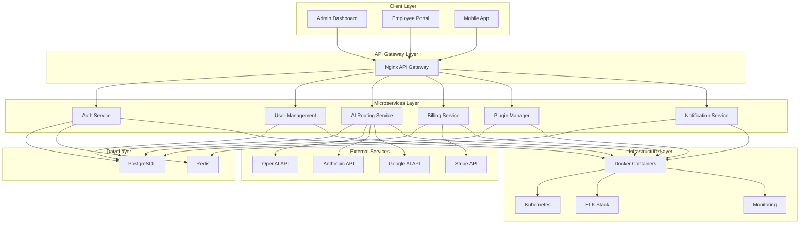

# AI Employee Platform - Architecture Documentation

## 🏗️ System Architecture Overview

The AI Employee Platform is built using a **microservices architecture** with a **monorepo structure**. This design provides scalability, maintainability, and clear separation of concerns while maintaining code consistency and shared utilities.

### Architecture Principles

- **Microservices**: Independent, scalable services with specific responsibilities
- **Domain-Driven Design**: Services organized around business domains
- **API-First**: All communication through well-defined REST APIs
- **Event-Driven**: Asynchronous communication where appropriate
- **Cloud-Native**: Containerized services ready for cloud deployment

## 📊 High-Level Architecture Diagram



## 🏢 Service Architecture

### 1. Authentication Service (`auth-service`)

**Port**: 9001  
**Responsibility**: User authentication, authorization, and session management

#### Key Features:

- JWT-based authentication with refresh tokens
- Role-based access control (RBAC)
- Session management with Redis
- Password hashing and validation
- Rate limiting and security middleware

#### Tech Stack:

- **Framework**: Express.js + TypeScript
- **Database**: PostgreSQL with Prisma ORM
- **Cache**: Redis for sessions
- **Security**: bcryptjs, JWT, rate limiting

#### API Endpoints:

- `POST /api/auth/register` - User registration
- `POST /api/auth/login` - User login
- `POST /api/auth/refresh` - Token refresh
- `GET /api/auth/profile` - User profile
- `POST /api/auth/logout` - Logout

### 2. User Management Service (`user-management-service`)

**Port**: 9004  
**Responsibility**: User CRUD operations, profile management, and user administration

#### Key Features:

- User profile management
- Admin user management operations
- User search and filtering
- Account activation/deactivation

### 3. AI Routing Service (`ai-routing-service`)

**Port**: 9002  
**Responsibility**: AI agent management, request routing, and response handling

#### Key Features:

- Multi-provider AI integration (OpenAI, Anthropic, Google)
- Smart routing based on cost and performance
- Request/response logging and analytics
- Rate limiting and quota management

#### Supported AI Providers:

- **OpenAI**: GPT-4, GPT-3.5-turbo, GPT-4-turbo
- **Anthropic**: Claude 3 Opus, Claude 3 Sonnet, Claude 3 Haiku
- **Google AI**: Gemini Pro, Gemini Pro Vision

### 4. Billing Service (`billing-service`)

**Port**: 9003  
**Responsibility**: Credit management, transaction processing, and billing operations

#### Key Features:

- Credit-based billing system
- Transaction tracking and history
- Stripe integration for payments
- Budget limits and alerts
- Usage analytics and reporting

### 5. Plugin Manager Service (`plugin-manager-service`)

**Port**: 9005  
**Responsibility**: Plugin lifecycle management, sandboxing, and marketplace operations

#### Key Features:

- Plugin installation and management
- Sandboxed plugin execution
- Plugin marketplace
- Version management and updates

### 6. Notification Service (`notification-service`)

**Port**: 9006  
**Responsibility**: Real-time notifications, WebSocket connections, and messaging

#### Key Features:

- WebSocket-based real-time messaging
- Email and SMS notifications
- Push notifications for mobile
- Notification preferences and templates

## 💾 Data Architecture

### PostgreSQL Schema Design

```sql
-- Core entities and their relationships
Users (1:1) CreditAccount
Users (1:N) AIRequests
Users (1:N) Transactions
Users (1:N) UserPlugins
AIAgents (1:N) AIRequests
Plugins (1:N) UserPlugins
```

#### Key Tables:

- **users**: User accounts and authentication
- **credit_accounts**: Credit balances and billing
- **ai_agents**: Available AI models and providers
- **ai_requests**: AI interaction logs and metrics
- **transactions**: Financial transaction records
- **plugins**: Available plugins and metadata
- **user_plugins**: User plugin installations

### Redis Data Structures

#### Session Management:

```
session:{sessionId} -> {userId, role, metadata, expiresAt}
user_sessions:{userId} -> [sessionId1, sessionId2, ...]
```

#### Caching:

```
user:{userId} -> cached user data
ai_agent:{agentId} -> cached agent configuration
rate_limit:{userId}:{endpoint} -> request count
```

## 🔌 API Gateway Architecture

### Nginx Configuration Highlights:

#### Routing Rules:

```nginx
location /api/auth/ {
    proxy_pass http://auth-service:9001/;
}

location /api/users/ {
    proxy_pass http://user-management:9004/;
}

location /api/ai/ {
    proxy_pass http://ai-routing:9002/;
}
```

#### Security Features:

- Rate limiting (100 req/min per user)
- SSL/TLS termination
- CORS configuration
- Security headers (HSTS, CSP, XSS protection)
- Request/response logging

## 📱 Frontend Architecture

### Admin Dashboard (`/apps/admin-dashboard`)

**Framework**: Next.js 14 with App Router  
**Styling**: Tailwind CSS + Shadcn/ui  
**State**: React Context + Custom hooks

#### Features:

- User management interface
- System monitoring dashboards
- AI agent configuration
- Billing and transaction views
- Plugin marketplace management

### Employee Portal (`/apps/employee-portal`)

**Framework**: Next.js 14 with App Router  
**Features**:

- AI chat interface
- Personal dashboard
- Usage analytics
- Plugin management

### Mobile App (`/apps/mobile-app`)

**Framework**: React Native  
**Features**:

- Cross-platform mobile access
- Push notifications
- Offline capability

## 🔧 Shared Architecture

### Monorepo Structure:

```
/packages/
├── shared-types/     # TypeScript definitions
├── shared-utils/     # Common utilities
├── ui-components/    # React components
└── api-client/       # HTTP client library
```

### Benefits:

- **Code Reuse**: Shared utilities and types
- **Consistency**: Unified coding standards
- **Type Safety**: End-to-end TypeScript
- **Build Optimization**: Turborepo for fast builds

## 🔒 Security Architecture

### Authentication Flow:

1. User login with email/password
2. JWT access token (15min) + refresh token (7 days)
3. Session stored in Redis with metadata
4. Token validation on each request
5. Automatic token refresh

### Security Measures:

- **Input Validation**: Zod schemas for all inputs
- **Rate Limiting**: Service-level and endpoint-specific
- **HTTPS Enforcement**: SSL termination at gateway
- **Security Headers**: HSTS, CSP, X-Frame-Options
- **Session Security**: Secure cookies, CSRF protection

## 📊 Monitoring Architecture

### Observability Stack:

#### Logging (ELK Stack):

- **Elasticsearch**: Log storage and search
- **Logstash**: Log processing and normalization
- **Kibana**: Visualization and dashboards
- **Filebeat**: Log collection from containers

#### Metrics:

- **Structured Logging**: JSON format with correlation IDs
- **Health Checks**: Service health monitoring
- **Performance Metrics**: Request duration, throughput
- **Business Metrics**: User activity, AI usage, billing

#### Key Monitoring Points:

- API response times and error rates
- Database query performance
- AI service costs and usage
- User authentication events
- System resource utilization

## 🚀 Deployment Architecture

### Containerization:

- **Development**: Docker Compose with hot reload
- **Production**: Multi-stage Docker builds
- **Orchestration**: Kubernetes ready

### Environment Separation:

- **Development**: Local Docker setup
- **Staging**: Cloud deployment with test data
- **Production**: Full cloud infrastructure

### CI/CD Pipeline:

1. Code push to repository
2. Automated tests (unit, integration, e2e)
3. Security scanning
4. Docker image building
5. Deployment to staging
6. Manual production deployment approval

## 📈 Scalability Considerations

### Horizontal Scaling:

- Stateless service design
- Database connection pooling
- Load balancing at gateway level
- Redis clustering for sessions

### Performance Optimization:

- Database indexing strategy
- Caching at multiple levels
- Async processing for heavy operations
- CDN for static assets

### Future Architecture Evolution:

- Event-driven architecture with message queues
- CQRS for complex business operations
- GraphQL federation for unified API
- Service mesh for advanced networking
